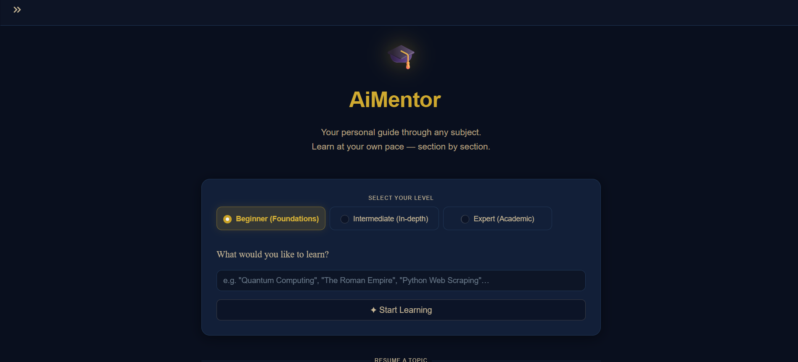
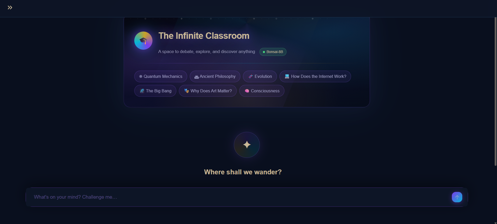
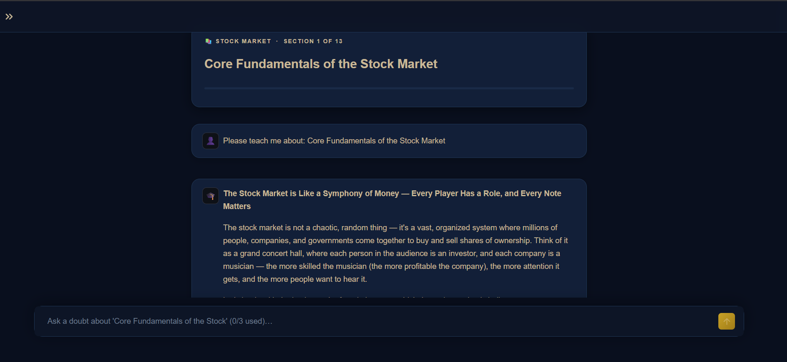
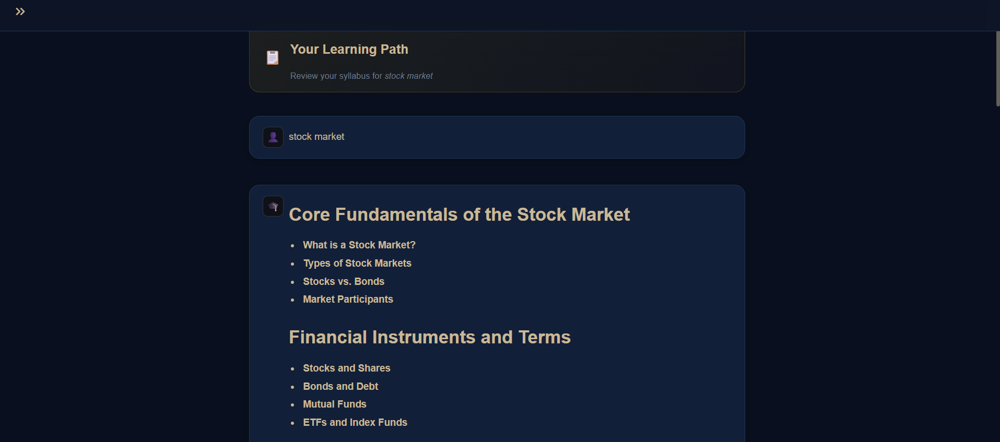
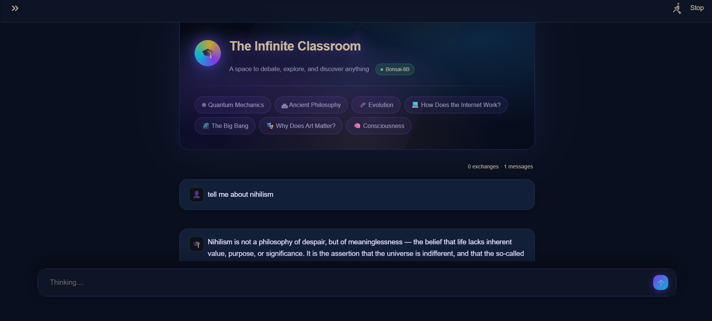

# <p align="center">✨ AiMentor — Premium Offline Academic Tutor ✨</p>

<p align="center">
  
  
  
  
</p>

---

### 🏛️ **The Vision**
AiMentor is more than just a chatbot; it's a **fully offline**, opinionated academic professor designed to guide you through complex subjects. Built with a stunning **Navy & Gold** aesthetic, it provides a high-end interface for structured learning and free-form intellectual debate.

> "Education is not the filling of a pail, but the lighting of a fire." — *AiMentor Design Philosophy*

---

## 🚀 **Quick Start (Windows)**

Experience elite learning in three simple steps:

1.  **Clone** this repository to your desktop.
2.  **Double-click** `setup.bat` 🔨 *(Handles Python, server binaries, and model weights).*
3.  **Launch** via `start.bat` 🎓.

*Prefer the terminal?*
```powershell
# Run with execution bypass
Set-ExecutionPolicy -Scope Process -ExecutionPolicy Bypass
.\download.ps1
```

---

## 💎 **Premium Features**

| Feature | Description |
| :--- | :--- |
| 📜 **Syllabus Architect** | Generates comprehensive, multi-phase learning paths dynamically. |
| 🧠 **Dual Brain** | Choose between **Structured Syllabus** or **Free-form Academic Debate**. |
| 🛡️ **Total Privacy** | 100% local operation. Your data never leaves your machine. |
| 💾 **Progress Sync** | Robust checkpoint system to resume your journey exactly where you left off. |
| 🎭 **Coded Personality** | Not a generic AI—it has opinions, a distinct teaching style, and intellectual rigor. |

---

## ⚙️ **The Engine Under the Hood**

AiMentor auto-configures itself based on your hardware for the smoothest experience possible.

### 🔌 **Hardware Profiles**

| Hardware | Default Model | Speed | Context Size | Max Output |
| :--- | :--- | :--- | :--- | :--- |
| **🚀 NVIDIA/AMD GPU** | **Bonsai-8B** | Near-Instant | 4,096 | 6,500 |
| **🐌 Standard CPU** | **Bonsai-4B** | Systematic | 2,048 | 1,024 |

---

## 🛠️ **Technical Requirements**

- **OS:** Windows 10/11
- **Storage:** ~3GB for GPU Profile / ~1.5GB for CPU Profile
- **Memory:** 8GB RAM minimum (16GB recommended)
- **Internet:** Required only for initial one-click setup

### 📂 **Directory Structure**
```text
AiMentor/
├── 🏗️ setup.bat         # One-click installation
├── 📥 download.ps1      # Smart downloader (Binary + Model)
├── 🚀 start.bat         # App launcher
├── 📄 app.py            # Streamlit Professor Interface
├── 📦 bin/              # Optimized llama-server binaries
└── 🤖 models/           # Local GGUF weights
```

---

## 🖼️ **Gallery**

<p align="center">
  <i>Elite Interface, Thoughtful Design</i>
</p>

| Structured Learning | Intellectual Debate |
| :---: | :---: |
|  |  |
| *Deep structured path* | *Fluid reasoning* |

<details>
<summary>📽️ View More Screenshots</summary>





</details>

---

<p align="center">
  Built with ❤️ by the AiMentor Team<br>
  <i>"Towards a smarter, local future."</i>
</p>
