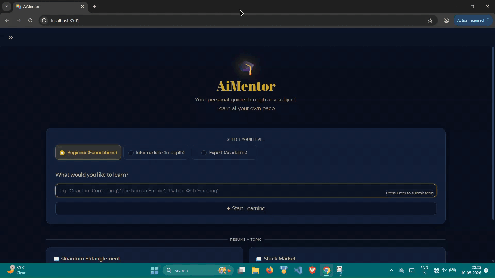
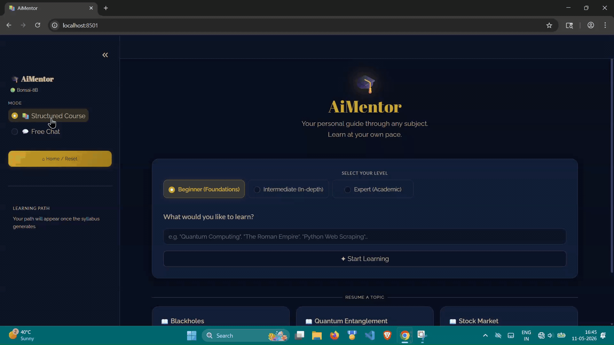

# AiMentor

AiMentor is a fast, fully local AI teacher for Windows powered by the 1-bit Bonsai 8B model.

It is built for people who want an AI tutor that runs on their own machine, responds quickly, and does not require expensive hardware or a cloud AI API. Bonsai 8B is a 1-bit model designed for efficient local inference, which makes AiMentor practical even on lower-end GPUs.

AiMentor is not meant to be just another chatbot with a teaching prompt. It has two separate experiences:

- **Structured Course**: the model creates a learning path first, then teaches section by section.
- **Free Chat**: a fast local chat mode for open-ended conversation.

Everything is local after setup. Your normal usage does not send prompts, chats, or learning sessions to an external AI service.

## Preview

AiMentor runs locally on your machine, so there is no hosted demo link. These recordings show the actual offline app experience after setup.

### Structured Course



### Free Chat



## Why this exists

Most AI tutors are still reactive chatbots. They can answer individual questions well, but longer learning sessions often drift:

- the conversation moves away from the original topic
- foundations get skipped
- explanations become disconnected
- the model behaves more like a general assistant than a teacher

AiMentor is built around a different constraint: before teaching begins, the model must create a learning path.

The student can review or edit that path. Only then does AiMentor start teaching one section at a time. This keeps the session anchored to the original learning goal instead of letting the conversation sprawl.

## What makes AiMentor different

- Powered by the efficient 1-bit Bonsai 8B model
- Designed for fast local responses
- Practical on a wide range of machines, including lower-end GPUs
- Runs locally on Windows with a local `llama-server` backend
- Creates a topic-specific syllabus before teaching
- Lets you review and edit the syllabus before starting
- Teaches section by section with progress tracking
- Allows doubts inside the current section
- Saves structured-course progress so you can resume later
- Includes a separate Free Chat mode for quick local conversation
- Uses no external AI API calls during normal use after setup

## Modes

### 1. Structured Course

Structured Course is the main teaching experience.

The flow is:

1. Enter a topic.
2. Choose your expertise level.
3. Let AiMentor generate a learning path.
4. Review or edit the syllabus.
5. Begin the course.
6. Learn one section at a time.
7. Ask doubts within the current section.
8. Move forward through the path in order.

This mode is intended for real learning, where sequence matters. The model is guided by the syllabus instead of improvising the whole session from the latest message alone.

### 2. Free Chat

Free Chat is intentionally separate from the structured teaching flow.

Use it for:

- quick questions
- casual conversation
- brainstorming
- general local AI chat
- topics that do not need a fixed learning path

Keeping Free Chat separate prevents the teaching experience from turning into an unstructured assistant conversation.

## Local-first design

AiMentor is designed around local use:

- the app runs on your Windows machine
- the model runs through a local `llama-server`
- conversations are handled locally during normal use
- first-time setup downloads the required runtime and model files

Internet access is only needed during setup to install dependencies and download the required files. After setup, the core experience is local.

## Requirements

- Windows 10 or Windows 11
- Internet access during first-time setup
- CPU, NVIDIA GPU, or AMD GPU runtime profile

AiMentor is intended to work across different hardware levels. During setup, you choose the runtime profile that matches your machine so the app can use the right binaries, model files, and launch settings.

## Installation

Clone or download this repository, then run:

```bat
setup.bat
```

During setup, choose the hardware mode that matches your machine:

- `CPU` for CPU-only or lower-resource systems
- `NVIDIA` for NVIDIA GPUs
- `AMD` for AMD GPUs

The setup process prepares:

- a Python virtual environment
- Python dependencies
- local `llama-server` binaries
- required GGUF model files
- runtime configuration for your selected hardware mode

## Running AiMentor

After setup is complete, run:

```bat
start.bat
```

This will:

- start the local model server
- launch the Streamlit app
- open AiMentor at `http://localhost:8501`

To stop AiMentor, run:

```bat
stop.bat
```

## Project structure

```text
.
|-- README.md
|-- setup.bat
|-- start.bat
|-- stop.bat
|-- assets/
|   |-- teaching.gif
|   `-- freechat.gif
`-- AiMentor_Core_DO_NOT_DELETE/
    |-- app.py
    |-- download.ps1
    |-- help.ps1
    `-- requirements.txt
```

Key files:

- `AiMentor_Core_DO_NOT_DELETE/app.py` - Streamlit app, teaching flow, Free Chat, progress handling
- `AiMentor_Core_DO_NOT_DELETE/download.ps1` - setup and model/runtime download logic
- `AiMentor_Core_DO_NOT_DELETE/help.ps1` - local startup orchestration
- `setup.bat` - first-time setup entry point
- `start.bat` - starts the app
- `stop.bat` - stops local processes

## Current behavior

AiMentor currently includes:

- expertise-level selection before syllabus generation
- syllabus-first structured learning
- editable syllabus review before teaching begins
- section-by-section teaching
- limited doubts per section to keep the session focused
- progress saving and resume support for structured courses
- separate saved Free Chat history
- local model serving through `llama-server`

## License

This repository is licensed under GPLv3.

## Acknowledgements

AiMentor uses the Prism AI Bonsai models and depends on Prism AI's `llama.cpp` fork for local execution.

If you use 1-bit Bonsai 8B, please cite:

```bibtex
@techreport{bonsai8b,
    title   = {1-bit Bonsai 8B: End-to-End 1-bit Language Model Deployment
               Across Apple, GPU, and Mobile Runtimes},
    author  = {Prism ML},
    year    = {2026},
    month   = {March},
    url     = {https://prismml.com}
}
```
